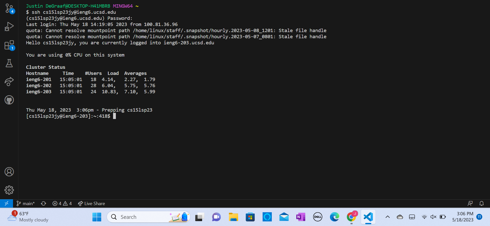
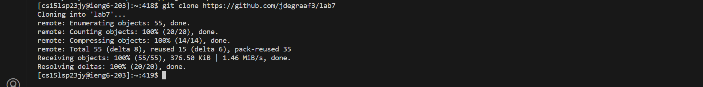
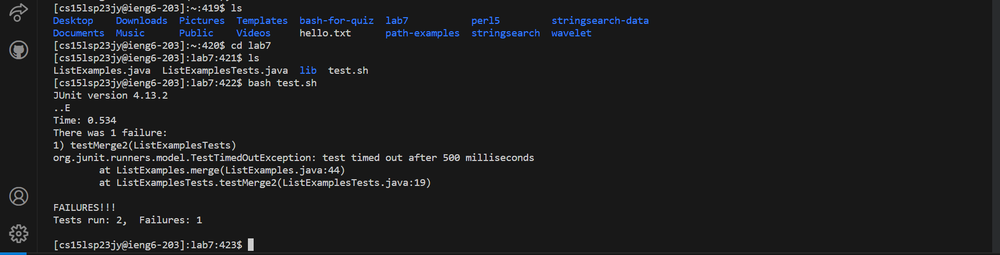
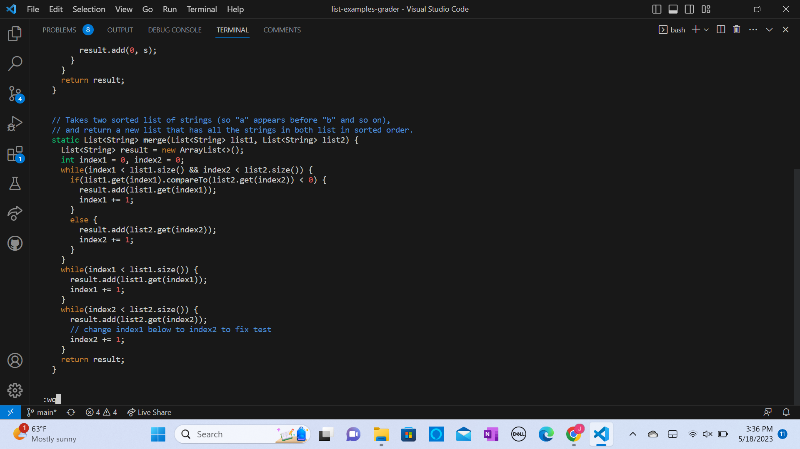
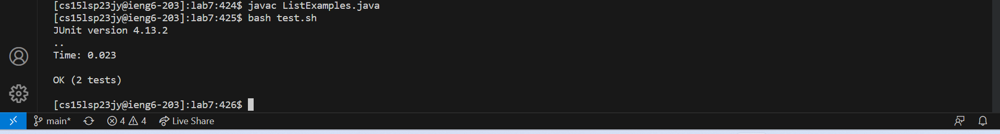
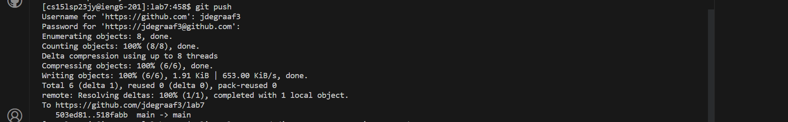
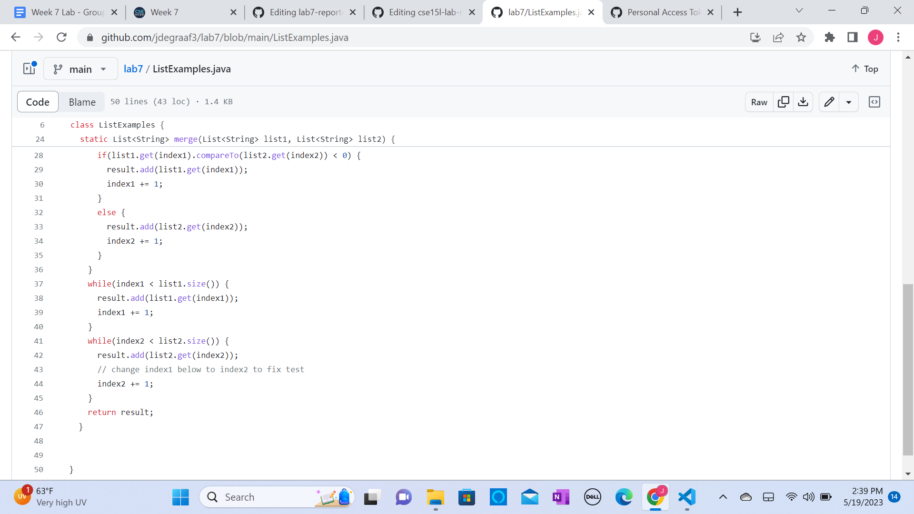

# Lab Report 4 - Vim Editor
## Step 4 - Log in

Keys Pressed:
ssh```<space>```cs15lsp23jy@ieng6.ucsd.edu```<enter>```
(my password)```<enter>```

## Step 5 - Clone Fork

Keys Pressed:
git```<space>```clone```<space>``````<ctrl>```v ```<enter>```

## Step 6 - Show Failure

Keys Pressed:
ls```<enter>```cd```<space>```lab7```<enter>```ls```<enter>```bash```<space>```test.sh ```<enter>```

## Step 7 - Edit ListExamples.java
```vim ListExamples.java```

Keys Pressed:
vim```<space>``````<shift>```lis ```<tab>```.java```<enter>```

Keys pressed once in vim editor on ListExamples.java (my cursor opened up right on the edit needed):
x i ```<esc>``` :wq ```<enter>```

## Step 8 - Show Success

Keys Pressed:
javac ```<shift>```l```<tab>```.java```<enter>```
bash```<space>```t```<tab>``````<enter>```

## Step 9 - Commit and Push

Keys Pressed:
git```<space>```add```<space>```-a```<enter>```
git```<space>```commit```<space>```-m```<space>``````<shift>```"```<shift>```fixed```<space>```index1```<shift>```"```<enter>```


Keys Pressed:
git```<space>```push```<enter>```
jdegraaf3```<enter>```
(my password/key)```<enter>```


As you can see in the picture above the git commit and push was successful and shows in the fork of lab7 on my github repositories.
